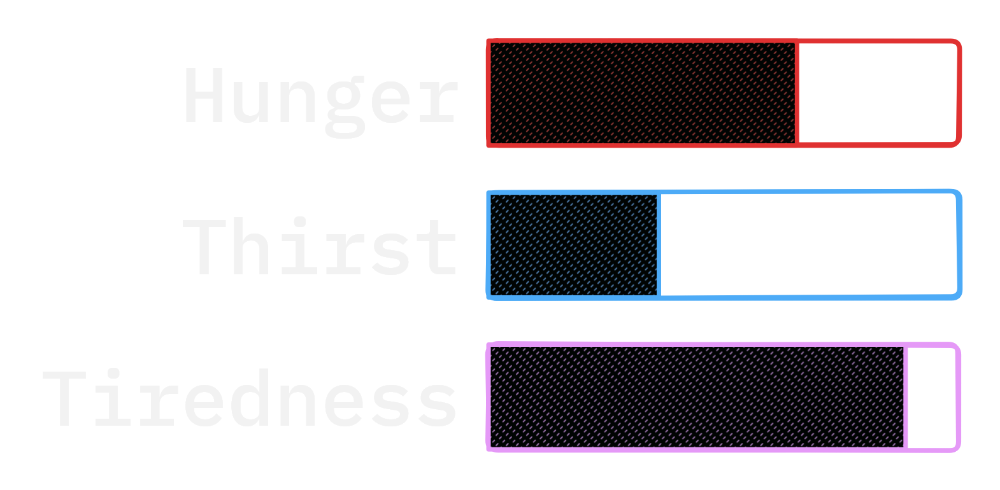
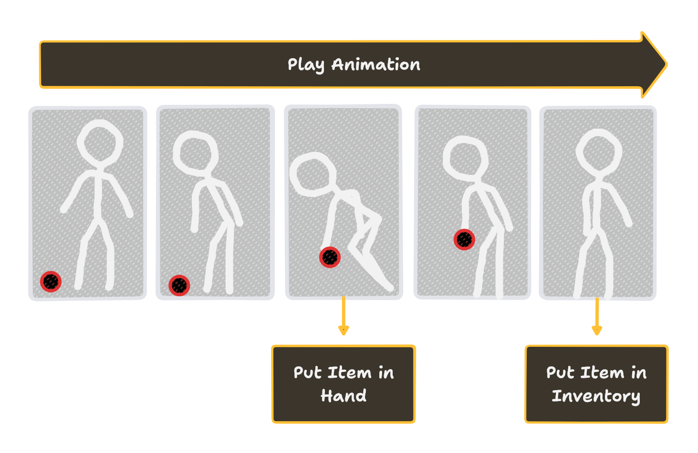
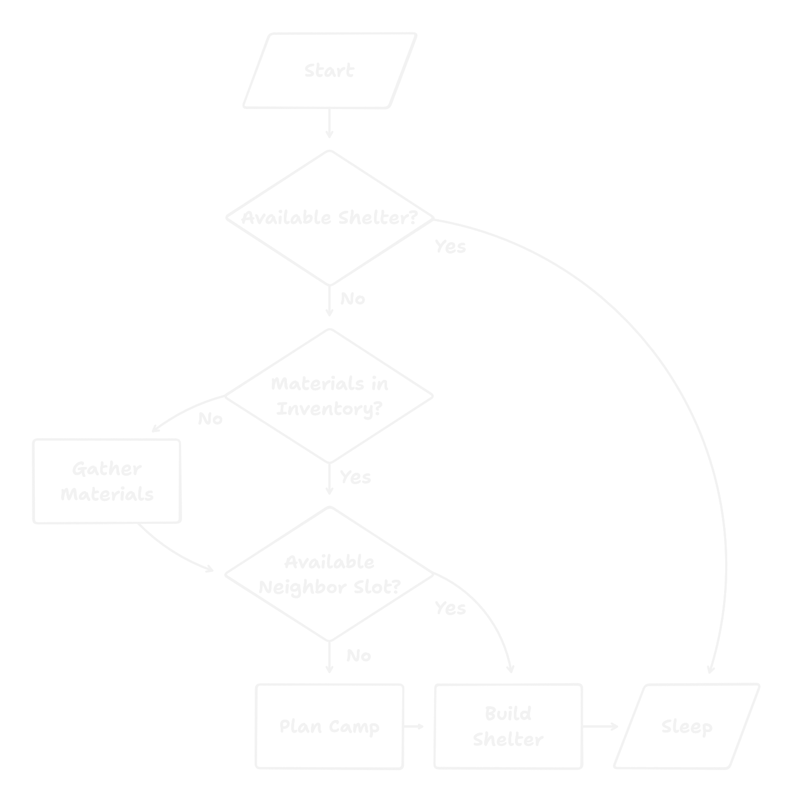
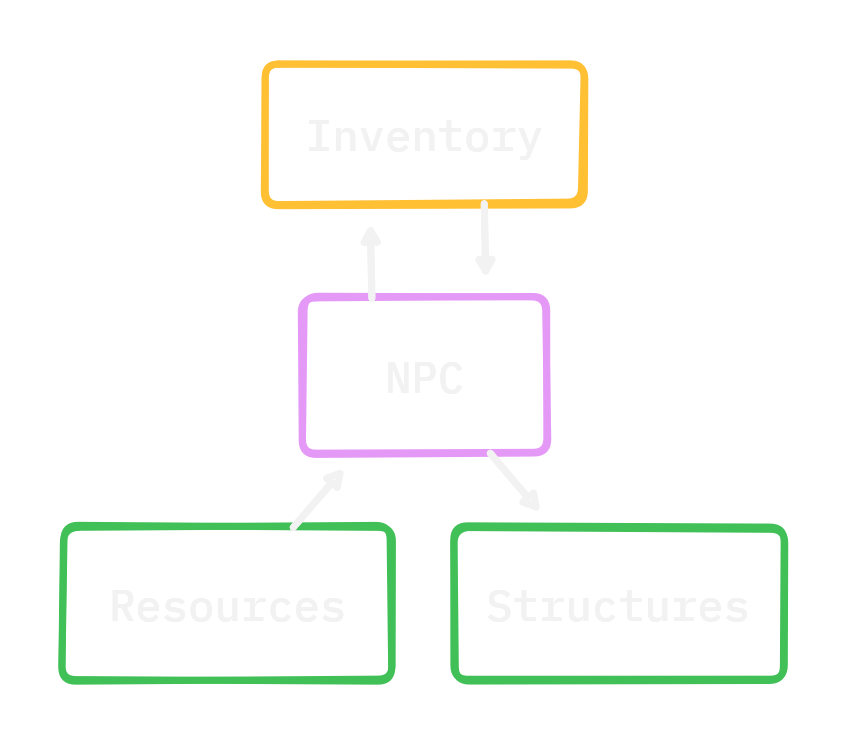
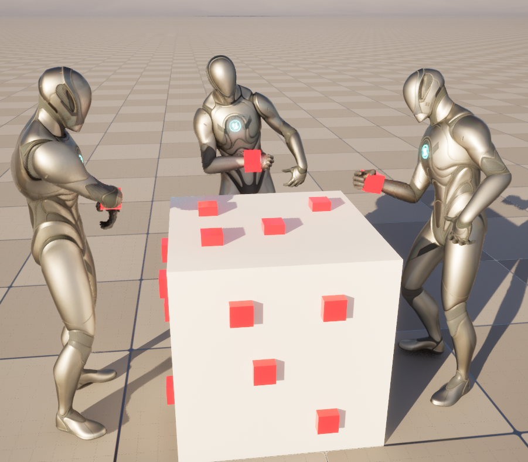

## Showcase



## Introduction
In many games, non-player characters (NPCs) play a significant role in both gameplay and the environment, interacting with players and making the world feel alive. This project explores how simulating complex NPC systems can lead to emergent gameplay experiences. Games that feature large and procedurally generated worlds particularly struggle to produce gameplay that scales with the environment. When NPCs are able to influence the world around them, they create opportunities for gameplay that meaningfully arise from the environment. By simulating individual NPC needs, goals and interactions, this system aims to produce dynamic world states capable of facilitating emergent gameplay. Unlike pre-scripted experiences, emergent gameplay arises from the system itself, offering greater variety and replayability.

## Needs-Driven Behaviour
The NPC's behaviour is fundamentally driven by three core needs:

The NPC behaviour is *reactive* which means that once one of its needs reaches a threshold, it reacts with the necessary behaviour to fulfil the need. Thirst is fairly simple as water must be drunk directly from a water source but tiredness is more complex, requiring sticks to be gathered and a shelter to be built. Although these actions require multiple steps, the behaviour is still reactive rather than deliberative (a planning behaviour model) because the NPC reacts to its need, then to the lack of materials needed to fulfil that need by gathering the resource. 

## Interacting with the Environment
Interactions with the world are defined by *smart objects* which handle the interaction logic, reducing the complexity of the NPC logic. Items are smart objects which can be picked up and placed in the inventory. When interacted with, the item smart object plays an animation and binds events to points in that animation such as when the item is put in the NPC's hand.

## The system as a Whole
In the completed simulation, a group of NPCs wander around until one of their needs (thirst, hunger and tiredness) goes over a threshold. If an NPC is thirsty, they move to a water source and drink the water. If an NPC is hungry they either pick up berries off the ground or from a berry bush and then eat them. If an NPC is tired, they look for a shelter, if none exist they will collect sticks to build one. When the NPC has enough sticks to build a shelter it looks for available locations in campsites of other shelters, if there are none, it will create it's own campsite instead.

The main mechanics at play here are the gathering of resources, an inventory to store the resources and the capability to build structures.

## Evaluating Emergent Gameplay

Some of the interactions between these mechanics are explicitly defined, however, even in this simple simulation emergent properties arise. To collect resources, an NPC must move to the item or the resource node, now when the NPC takes it's next action, it may choose a different location to perform that action. As NPCs use up the available resources in an area, they may be forced to go further to get what they need, the population could split up and when they build their shelters separate camps may be formed. This not only creates a more varied environment with reason behind the variation rather than random chance, but when the player comes to interact with the environment, their experience will be affected. A player could interact with the environment at the same level as the NPCs, they might require resources that the NPCs have harvested and so have to explore further or perhaps they need shelter and are able to make use of a camp abandoned by NPCs looking for food.

These situations provide variety in the player's environment and challenges and by driving this variation with a simulation, the situations are justified and interesting. The player is motivated to understand the mechanics of the game so that they may benefit from or manipulate the emergent properties. Furthermore, while the simulation is simple it shows the potential for emergence driven by NPCs. Direct interaction between NPCs is a future development that could improve opportunities for emergent gameplay. NPCs could trade resources or information, form social connections and collaborate on tasks.