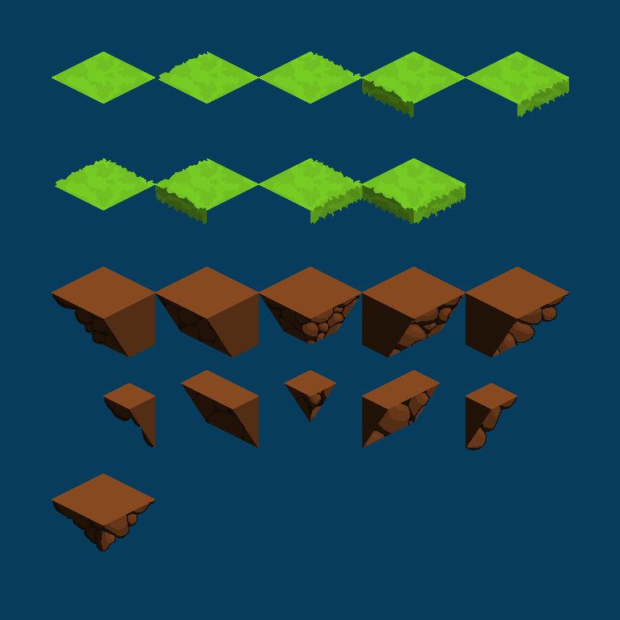
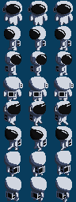
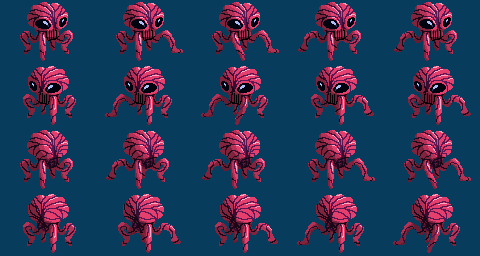

The goal of this project was to create a web-based game using the [Phaser](https://phaser.io/) engine. I wanted to create a game set on an asteroid belt made from floating islands. To make this work visually, an isometric style was used. I created the island from a set of tiles to allow different islands to be created easily.

The player character was drawn with a three frame walking animation for eight directions.

An enemy character was also drawn with an five frame walking animation in four directions.

One of the major parts of the project was getting isometric collisions to work. Phaser has isometric support for drawing the tiles but not for collisions so I decided to modify the Phaser library by patching functions to add isometric collision support. The broad phase collision detection was reltively simple in the original version, however as the sprite collider rectangle was aligned with the regular axis rather than the isometric axis this was much more challenging. With some research I found that if you add the x and y co-ordinates of an isometric grid point, you get a constant for the cartesian column and you get the row constant by subracting the co-ordinates. Using these equations and their reverse, I was able to loop through the columns and rows in the rectangle and get the tiles within. This method could get some unnecessary corners, but I couldn’t figure out how to avoid that and it didn’t effect the end result as I’d still check all these tiles for actual collision. Next, to handle the actual collision, I calculated the world-coordinates of each of the corners of the bottom face of an isometric cube from the tile position and stored them as quad. I use the cross product of the edge of the isometric face and the corresponding corner of the sprite collision body to tell if the point has passed the line as the cross product will be greater than zero if it has.