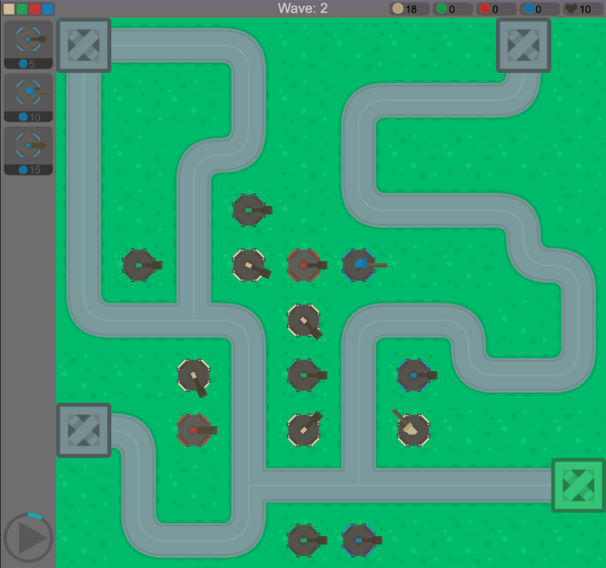

Part of my Games Production BTEC was to create a game using Construct 3, a simple online game engine. I created a tower defence game called ColourTD. It was based around the concept that towers could only destroy enemies of the same colour and included a level generator that could generate levels from json files. Tower types could also be generated from a json file which made the game easily modifiable.

