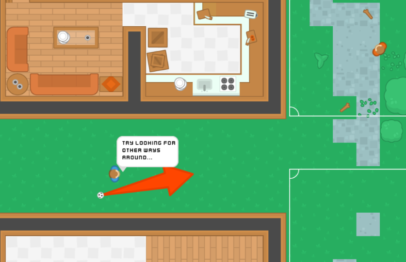

Part of my Games Production BTEC, was a 24 hour exam where I was tasked to design and develop a game in an exam with the theme of 'sports'. I created a top-down football game where you had to kick a football though a map and past defenders who defended marked boxes until the ball was kicked into the goal at the end.

