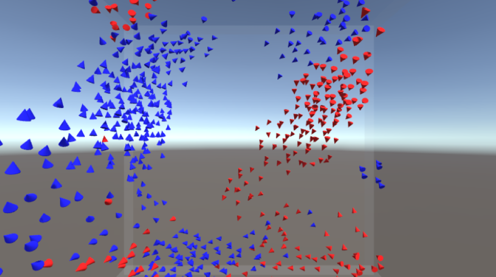



For my A level computer science coursework, I created an ocean simulation that simulated shoaling sea creatures and interactions between them using the BOIDS algorithm. It includes a variety of species, each with diffferent shoaling behaviors such as group size and how densly they shoal. The simulation also includes predator species that will chase nearby prey which swin away from their predators. Creatures can be selected to highlight and track them as well as view information about the species.

