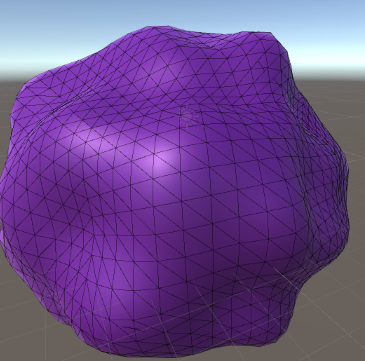

For my AS level Extended Project, I created a program that randomly generates planets for use in games or simulations. I did this by generating a sphere that I manipulated with random, coherent noise. I then layered different variations of that noise on top of each other with varying layers of detail. I also created a shader that coloured the planet based on the terrain’s height and added biomes that generate based on the longitude. Finally, I coloured the ocean based on its depth. The purpose of my project was to experiment with randomised generation of terrain. I covered new areas in this project such as mesh generation, procedural textures, and editor menus.

