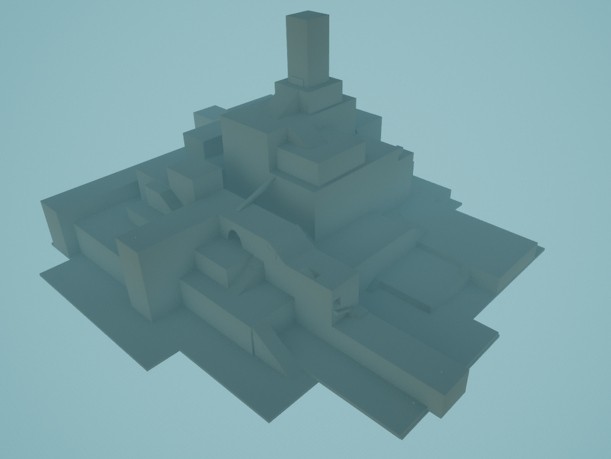
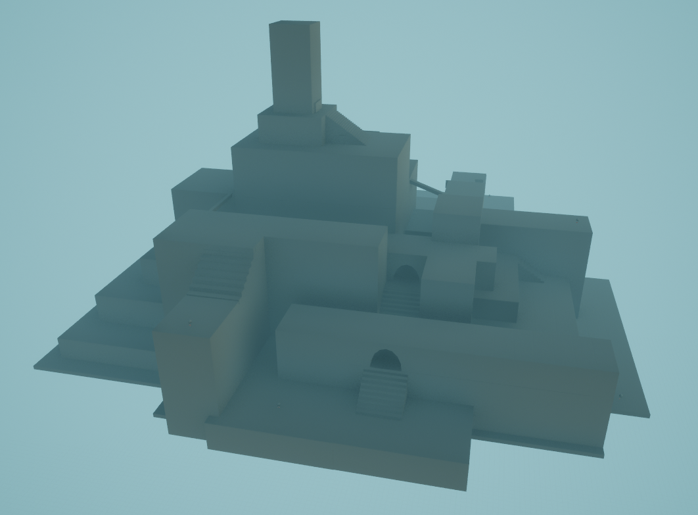
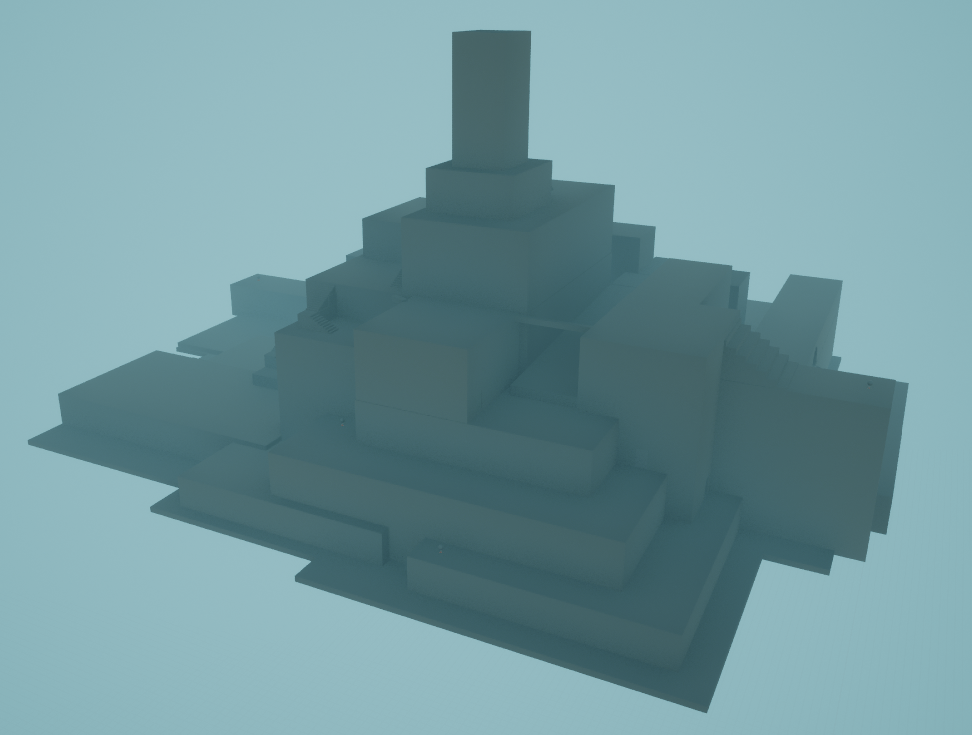
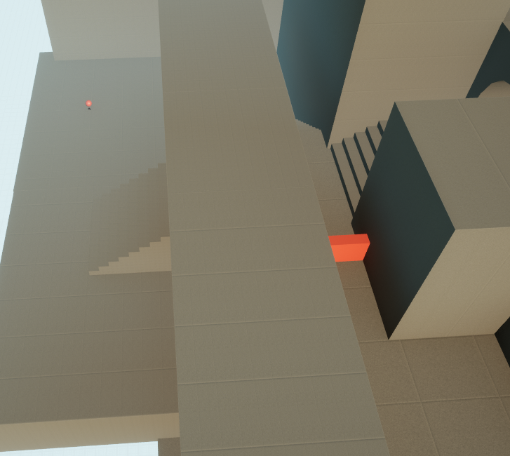
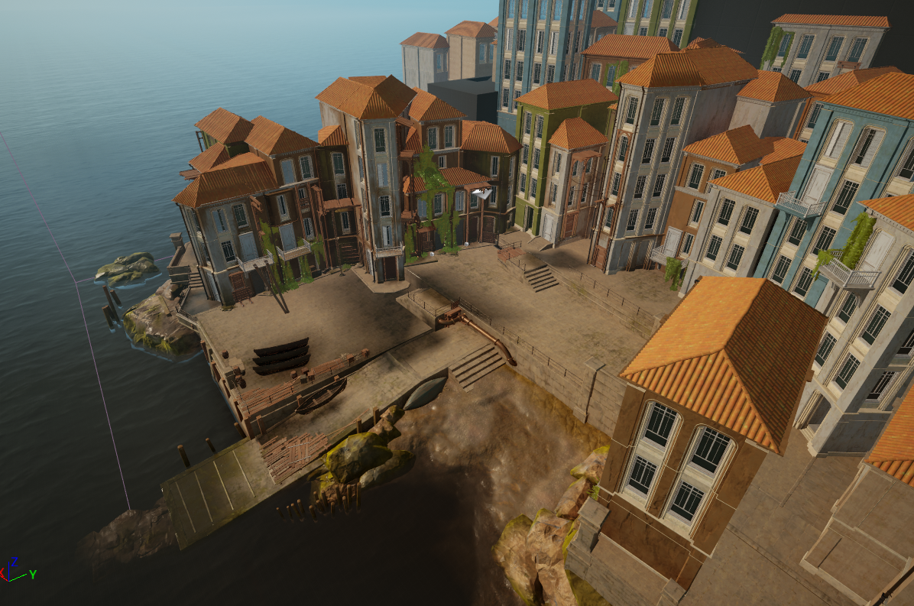
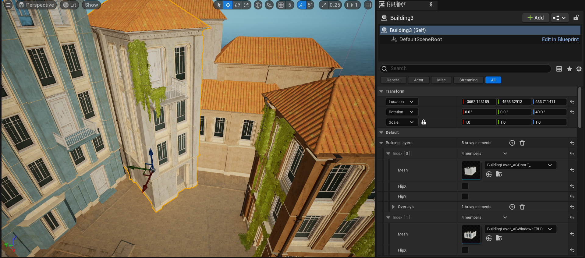
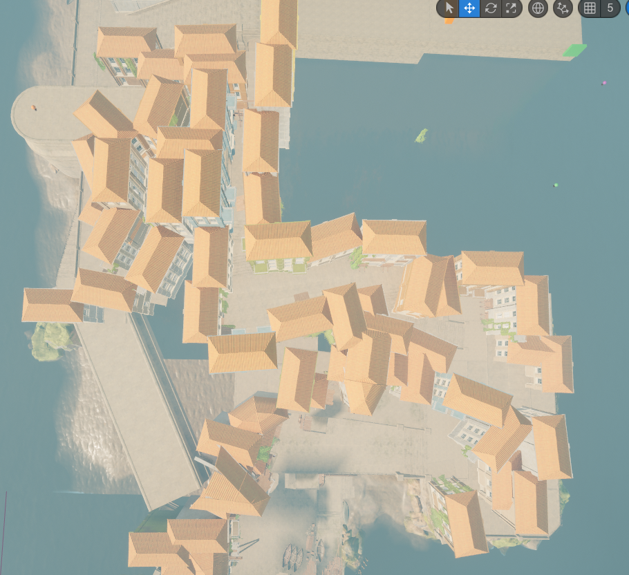

## Goal
The goal of this project was to create an short puzzle game in Unreal Engine that would allow me to develop my level design skills. While creating the level I found some opportunities to improve my workflow and build the level faster by developing an asset that allowed me to quickly create different variations of buildings. The main gameplay loop consists of a series of puzzles where the player finds their path forward blocked and then explore to find the triggers needed to unblock it.

## Outcome
This project gave me the opportunity to explore some aspects of game development more than I have before, particularly level design. The puzzles were interactive and satisfying to complete but could have been more complex. The level was detailed enough for a prototype, but could be improved for a full game. The early stages of the level did not have much for the player to do except run through them, which not only can be a bit boring but also means that the player has no reason to stay in those areas and experience and appreciate them. This could be solved with more puzzles, a more advanced movement system and obstacles to accompany it, or a more complex route through the areas which could make use of building interiors and have optional 
 routes and objectives. As I progressed through the project, I learned to create areas quickly before going back to add passes of detail. I also used some new tools such as the texture paint tool and the modelling tool. This project refreshed my knowledge of Unreal Engine and allowed me to expand on it by creating development tools, blueprints for gameplay logic, and a post-processing material.

## Level Design
I started the level design process by grey boxing the general layout for the level. During this process I focused on the route I wanted the player to take to the end. I decided on a spiral shaped main path around the hill that the town was built on and then used the remaining space to add branching paths that the player could use to complete objectives and unblock the way forward.

During this stage I also creared a simple version of the puzzle system where the player had to reach a number of objectives to unblock the path. Adding this in this stage allowed me to plan the puzzles in their most basic form and design the level layout to accommodate for them.

The player would start washed up on a beach so I created a small beach and boat ramp as well as a variety of buildings around an open courtyard using a seaside town asset pack. To achieve the level of detail that I wanted, I had to spend quite a lot of time adding vines, balconies and different layouts so that any replication of buildings that I had already made wouldn’t be too obvious.

After creating this first area I evaluated the design and layout and how the player would move through it and decided that it took too long to create these more open spaces which the player would move through quite quickly. To solve this issue, I decided to keep the streets narrower in future and wind them around the play area. This would also fit the theme of an old-style Mediterranean town better. I also noticed that most buildings could have the same footprint different orientations and heights. I made creating these buildings faster by creating a blueprint that would allow me to select the asset for each layer and then stack them automatically. To reduce the number of varieties of layers I would have to create, I allowed the assets to be flipped as well as adding an array of meshes that could be overlayed on top of the base asset such as vines, balconies and drainpipes already set up in preset configurations that I could choose between.

I used my building blueprint to create the next area in the level, placing the buildings around the path that the player would follow.

## Puzzles
The puzzles have an obstacle blocking the way forward with one or more keys/triggers that can be used to overcome the obstacle. To help the player identify what they can interact with, I created a post-processing material that highlighted objects with an outline when they could be interacted with.

The first puzzle had some scaffolding blocking the way that can be knocked over by sawing one of the pieces. I created a simple item pick up system for the saw and enabled physics on the scaffolding when it was interacted with while the saw was held.

The second puzzle involved turning three valves to trigger an explosion and clear the path ahead. I designed parts of the previous puzzle system to be reusable here. Each switch object stored the triggerable object in an instance editable variable and the triggerable object had a variable that stored the amount of triggers it had associated with it. I created a child of the triggerable object class and added a pipe mesh and a destroyed variant, an explosion particle effect, an explosion sound and a repel force effect to move the objects blocking the way. These would all activate once all three switches had been triggered.